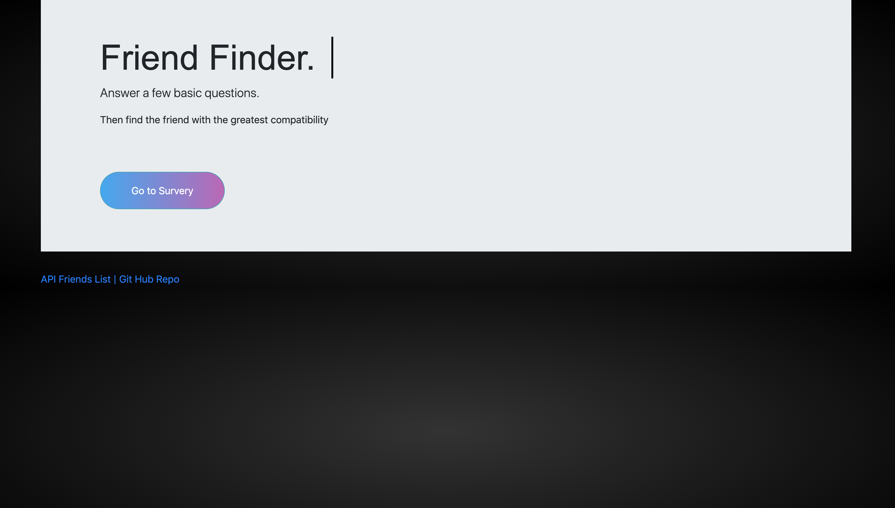
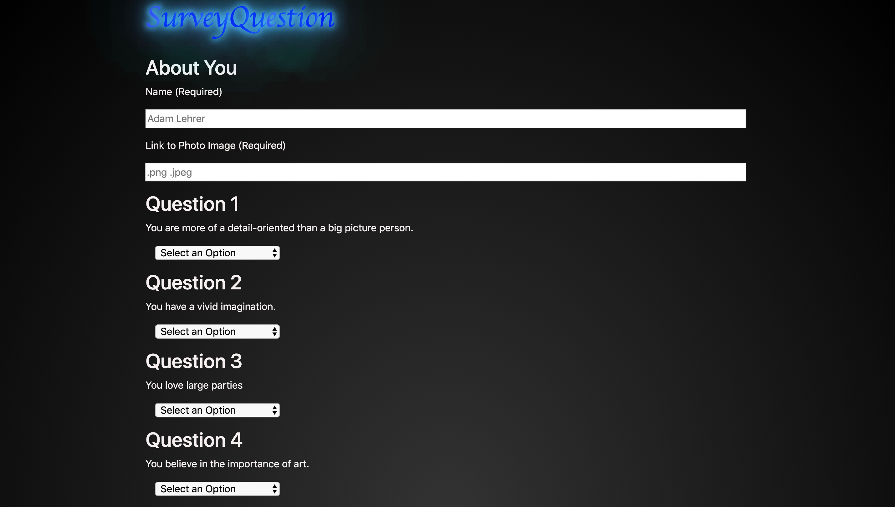

# FriendFinder
FriendFinder being hosted on <a href="https://friendfinder394.herokuapp.com/survey">Heroku</a> additionally we list a port to host this locally on our own computers local server. We are linking our server Javascript to our route Javascript files, then when our server is asked for a request to get information it will follow the routes provided to either the survey html page or home html page. Additionally when a user has taken our survey the information will be sent as a post request bringing back information to display. We take the users information and loop through the individual scores. Comparing each score to our databases stored scores and and them to a variable to increments each time there is a difference. Once the user is compared against another users 10 stored scores we store this variable in a with a an object with a key linking to the users score as well as a key linking to there name and photo  and push it into and array to keep track of the information. Lastly we need to sort the users compared score against the database to find the lowest score and closest match. We pull this index and post it to the page along with the participates information!
 

## Perquisites
You can either choose to visit the deployed version on Heroku or clone the the file from Git hub and run in your local browser. For this you will need to install express.

## Running Tests/Instructions
Open the file in your text editor or terminal. Install the node packages listed below. Move into the file you have saved the file in and type node < the filename >.js. This will start the application running.

## Built with:
<ol>
<li> Javascript
<li> Express
</ol>

### Local Development Environment for website Repo
The following will get up and running locally.

Author
Adam Lehrer

